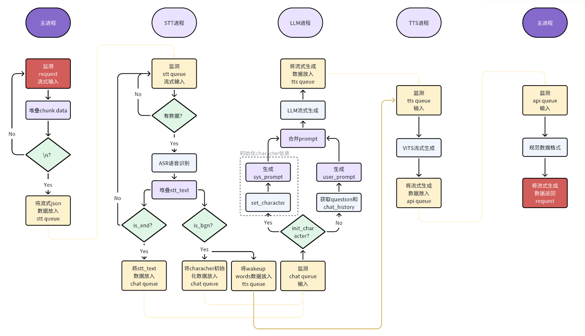

Takway.AI
=========

### 面向角色扮演功能的多模态交互系统 [[飞书Link](https://lleeei6t29.feishu.cn/docx/BzVWd57K9oyVSixhTamcv4tSnHf)]

- 前端：基于Linux端侧平台的语音、视觉交互系统，可以实现语音唤醒、语音输入、语音播放、表情互动等功能。其中语音输入框架如图所示：


- 后端：基于Python Flask框架的后端语音识别服务，可以实现流式语音识别、大模型流式生成、流式语音合成等功能。后端多进程框架如下图所示：



---

### 项目更新日志

- **2024.2.16**：
  完成本地Client段基本架构设计
- **2024.2.17**：
  1. 本地语音系统代码封装 `PicovoiceRecorder`：
     ①增加VAD功能；
     ②增加 `Picovoice`的语音唤醒功能；
  2. 本地EMO表情管理模块代码封装 `EmoVideoPlayer`：
     ①增加随机wink功能；
     ②预留服务器端自定义表情接口；
  3. 完成本地Client客户端多进程系统搭建；
- **2024.2.18**：
  1. 星火大模型代码封装 `SparkChatClient`：
     ①支持流式输出；
  2. VITS TTS代码封装 `TextToSpeech`：
     ①支持流式生成音频；
  3. 本地音频播放模块代码封装 `AudioPlayer`：
     ①支持VITS输出无损转换PCM；
     ②支持流式播放音频；
- **2024.2.22-2.24**：
  1. 完成后端服务器全流式多进程高并发并发系统 `TakwayApp`搭建；
     ①多线程支持流式获取并识别语音片段，等待完全识别后送入大模型生成部分；
     ②多线程支持流式大模型生成内容；
     ③多线程支持流式获取大模型输出，并输入到VITS端流式合成音频；
     ④流式返回音频数据，并实现本地快速播放；
- **2024.2.25**：
  1. 完成板载前端系统和后端服务器对接；
     ①设置回答表情反应；
     ②；
     ③多线程支持流式获取大模型输出，并输入到VITS端流式合成音频；
     ④问题：当语音流式播放时，动画播放卡顿，延迟高；
- **2024.2.26**：
  1. 封装Character角色扮演代码封装 `RolyPlayingCharacterInfo`和 `RolyPlayingFunction`：
     ①支持自定义sys_prompt及调用；
     ②支持前端/后端character信息调用；
  2. 封装基于星火大模型的角色扮演对话系统；
  3. 封装基于本地Client的角色扮演系统；
  4. 重构前后端通信数据格式；
- **2024.2.27**：
  1. 调试并确认完成前后端通信数据格式；
  2. 初步确认大模型角色扮演系统运行。
- **2024.3.1**：
  1. 项目发布！

---

### 功能支持

- [√] 前端语音唤醒
- [√] 后端全流式流式生成

- [ ] 高并发后端设计
- [ ] 高性能ASR模型
- [ ] 国内大模型Role-playing Benchmarking

## 安装和运行：

============

1. 克隆项目到本地：

   ```
   git clone https://github.com/Irvingao/takway_base.git
   cd takway_base
   ```
2. 创建conda环境并安装依赖：

   ```
   conda create -n vits python=3.8
   // 安装Pytorch，其他版本参照：https://pytorch.org/get-started/previous-versions
   pip3 install torch torchvision torchaudio --index-url https://download.pytorch.org/whl/cu118 
   pip install -r requirements.txt
   ```

   - 安装vosk pip预编译库:

     - [Linux whl](https://github.com/alphacep/vosk-api/releases/download/v0.3.45/vosk-0.3.45-py3-none-linux_x86_64.whl)、[Win whl](https://github.com/alphacep/vosk-api/releases/download/v0.3.45/vosk-0.3.45-py3-none-win_amd64.whl)

     ```
     pip install xxx.whi
     ```
3. 下载相关模型文件:

   - Vosk语音识别模型：[vosk-model-cn-0.22.zip](https://alphacephei.com/vosk/models/vosk-model-cn-0.22.zip)
   - VITS语音合成模型：[vits-uma-genshin-honkai](https://huggingface.co/spaces/zomehwh/vits-uma-genshin-honkai/tree/main)
4. 配置星火大模型的API：

   - `main.py`中的 `appid`、`api_secret`、`api_key`，参考：[快速指引](https://www.xfyun.cn/doc/platform/quickguide.html#%E7%AC%AC%E4%B8%80%E6%AD%A5-%E6%B3%A8%E5%86%8C%E6%88%90%E4%B8%BA%E5%BC%80%E5%8F%91%E8%80%85)。
5. 运行项目：

- 前端(Linux板卡端)：
  ```
  python web_request_mp_manager_pico.py
  ```
- 后端(本地端):
  ```
  python app.py
  ```

### 人物列表

- 可以通过脚本查看人物的序号:
  ```
  python list_characters.py
  ```

```

103: 可莉
104: 钟离
107: 达达利亚（公子）
111: 甘雨（椰羊）
115: 刻晴
119: 胡桃
120: 枫原万叶（万叶）
133: 八重神子（神子）
134: 神里绫人（绫人）
142: 纳西妲（草神）
```
